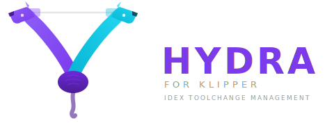

<p align="center">
  
</p>

<p align="center">
  <em>A complete IDEX toolchange management system for Klipper</em>
</p>

---

## Why Hydra Exists

Klipper's `[dual_carriage]` gives you the hardware foundation for IDEX printing - it can switch carriages and track two extruders. But that's where it stops. Out of the box, there are no toolchange macros, no temperature management between tools, no fan routing, no calibration system, and no UI. You're left to figure out the entire toolchange workflow yourself: when to retract, how to park, how to handle standby temperatures, how to prevent the inactive nozzle from dragging across your print, and how to calibrate the offset between two nozzles that have never met.

Every IDEX Klipper user ends up writing the same fragile macros from scratch, debugging the same edge cases, and reinventing the same solutions.

## What Hydra Does

Hydra is a complete IDEX management system that picks up where Klipper leaves off. It handles every aspect of dual-nozzle printing:

**Intelligent Toolchange** - A full park/restore sequence with filament retraction, temperature standby, fan management, collision avoidance, and per-tool state tracking. Handles both hot toolchanges during a print and cold manual switching from the UI.

**Gcode Lookahead** - A Moonraker preprocessor scans uploaded gcode and rewrites toolchange commands with the next print position, so the incoming nozzle moves directly to where it's needed instead of dragging across the other color's part:

```gcode
; Before:  T1
; After:   IDEX_TOOL_CHANGE T=1 NEXT_X=201.101 NEXT_Y=188.646 ; T1
```

**Calibration System** - A guided workflow for aligning T1 to T0: Z-offset paper test with auto-save (using KlipperScreen's familiar TESTZ interface), two-phase XY alignment (visual eyeball with live D-pad nudge, then precision print test with concentric squares), and persistent offset storage that survives restarts.

**Smart Print Lifecycle** - START_PRINT that knows whether a file uses one tool or two (via slicer's `[total_toolchanges]`), only preheats T1 when needed, and initializes the toolchange system automatically. PAUSE parks the active tool, RESUME restores it.

**Fan Routing** - M106/M107 overrides that route part cooling commands to the active tool's fan. No more manually managing which fan pin gets which speed.

**Zone LED Effects** - Split your LED strip into per-tool zones that independently show each nozzle's state: preheating, printing, standby, idle. See at a glance what both tools are doing.

**KlipperScreen Integration** - Dashboard for tool selection and status, XY alignment visualization with Cairo-drawn square overlay, and a D-pad interface for live nozzle nudging during calibration.

**Everything Configurable** - One file (`hydra_variables.cfg`) controls retract distances, speeds, park positions, standby temperatures, fan pins, LED zones, calibration reference points, and collision safety margins. Zero hardcoded values in the macro logic.

## Requirements

- Klipper + Moonraker
- IDEX printer with `[dual_carriage]` configured
- Python 3.7+
- `[save_variables]` configured in Klipper

## Quick Start

```bash
cd ~
git clone https://github.com/3dprintpittsburgh/Hydra-For-Klipper.git
cd Hydra-For-Klipper
./scripts/install.sh
```

Then:
1. Add `[include hydra.cfg]` to your `printer.cfg`
2. Add `[hydra_idex]` section to `moonraker.conf`
3. Edit `hydra_variables.cfg` with your printer's values
4. Remove any existing T0/T1/M106/M107/START_PRINT macros
5. Restart Moonraker and Klipper

## Documentation

| Guide | Description |
|-------|-------------|
| [Configuration Reference](docs/configuration.md) | All variables, slicer setup, file structure |
| [Calibration Guide](docs/calibration.md) | Z-offset, XY visual alignment, XY print test |
| [LED Setup](docs/led-setup.md) | Zone-aware LED effects with per-tool states |
| [Preprocessor](docs/preprocessor.md) | How gcode lookahead works |
| [KlipperScreen](docs/klipperscreen.md) | Dashboard and calibration panels |
| [Troubleshooting](docs/troubleshooting.md) | Common issues and solutions |
| [Development Notes](docs/DEVELOPMENT-NOTES.md) | Internal architecture and lessons learned |

## Toolchange Sequence

```
1. PREHEAT incoming nozzle (non-blocking M104)

2. PARK outgoing tool (_HYDRA_PARK)
   ├── Save position, save/disable fan
   ├── Retract filament, drop to standby temp
   ├── Z hop, move to park position
   └── LED: zone → standby

3. ACTIVATE incoming tool (_HYDRA_ACTIVATE)
   ├── Switch carriage, apply gcode offsets
   └── Wait for temperature

4. NOZZLE WIPE (if enabled)
   ├── Move to wiper position, extrude purge line
   ├── Fan blast to solidify
   └── Snap move against wiper wall to knock off blob

5. POSITION incoming tool (_HYDRA_POSITION)
   ├── Move XY to target (lookahead, saved, or bed center)
   ├── Drop Z (undo hop)
   ├── Prime filament, restore fan
   └── LED: zone → printing
```

## Compatibility

- **Slicers**: PrusaSlicer, OrcaSlicer, Cura
- **Firmware**: Klipper with `[dual_carriage]`
- **Frontends**: Fluidd, Mainsail, KlipperScreen

## Contributing

Contributions welcome! Please open an issue or PR on GitHub.

## License

GPLv3 - See [LICENSE](LICENSE)

## Credits

- Inspired by [Happy Hare](https://github.com/moggieuk/Happy-Hare)'s gcode preprocessing architecture
- Built by [3D Print Pittsburgh](https://3dprintpgh.com)
